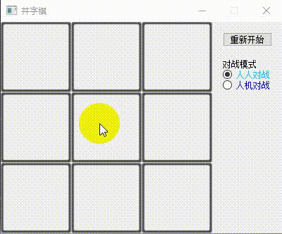
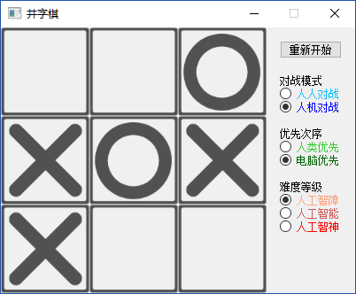
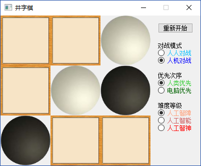
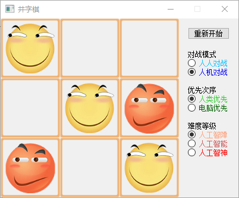

# 井字棋（tic-tac-toe）

使用α-β剪枝（Alpha-beta-pruning）的极小极大算法（Minimax-algorithm）实现的井字棋（一字棋、tic-tac-toe）游戏。

## 下载

[tic-tac-toe/releases](https://github.com/huihut/tic-tac-toe/releases)

## 演示

## 更换主题

使用`tic-tac-toe\theme\theme*\`下三个图片替换`tic-tac-toe\src`中的三个图片即可更换主题。

* 主题一

  

* 主题二

  

* 主题三

  
